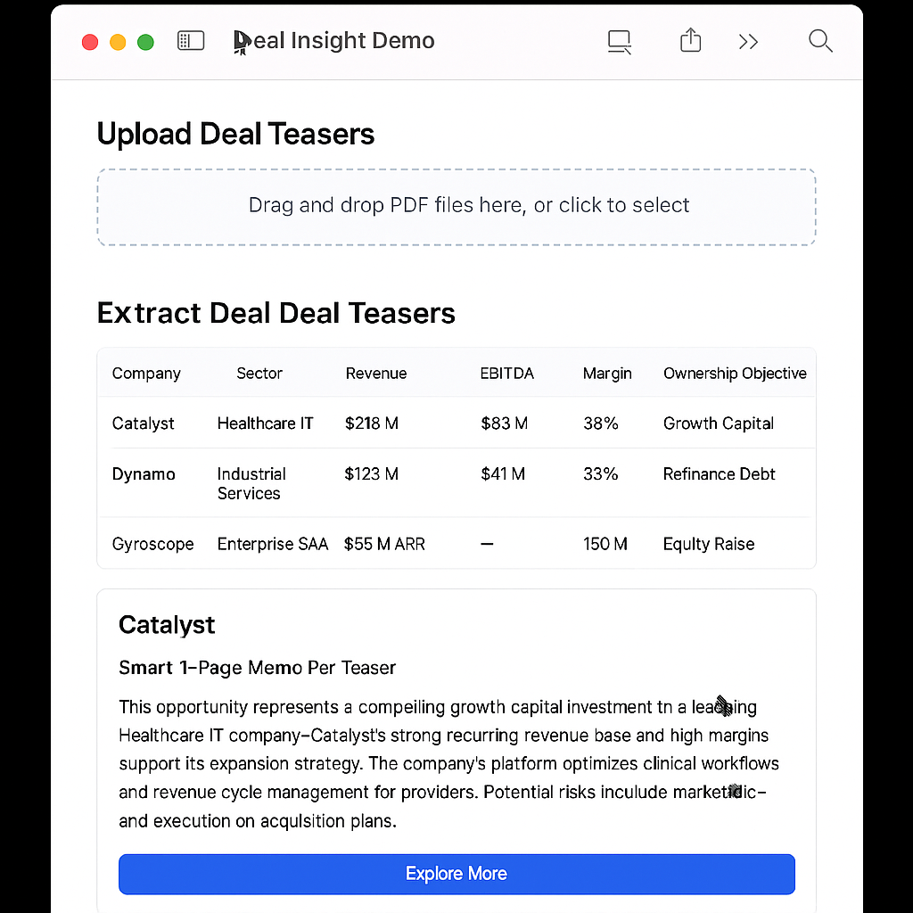

# Deal Insight AI

A full-stack AI-powered deal intelligence platform for private credit investors and bankers.

## Example screenshot



## Features
- Upload teaser PDFs
- Extract and compare key deal metrics
- Generate personalized investment memos with LLMs
- Identify basic comparables and risk indicators
- Extend with public data enrichment

## Tech Stack
- Frontend: React + Tailwind (ShadCN UI)
- Backend: FastAPI + LangChain + OpenAI
- Database: PostgreSQL

### Database Schema
- **deals**: extracted fields, AI insights, comparables and risks
- **users**: name, mandates and preferred sectors
- **memos**: AI generated memos linked to deals

## Setup

1. Create a `.env` with your OpenAI key and database URL
2. From the project root, run the backend (the `backend` directory is a Python package):
```bash
uvicorn backend.app.main:app --reload
```
3. Install frontend dependencies and run the dev server:
```bash
cd frontend
npm install
npm run dev
```

